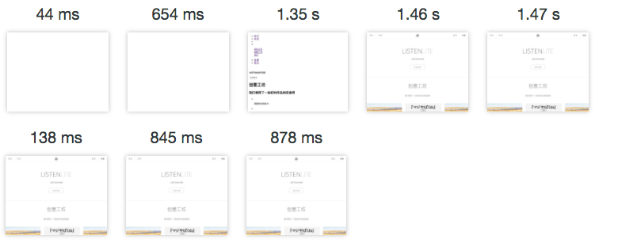

<div align="center">
  <a href="https://github.com/aemoe/fairy">
    
  </a>
  <h2>Fairy - 一个前后端分离框架 </h2>
  <p align="left">
  一个能够支持前后端分离并支持中间层同构的完整框架,或许现在它还不够完善,但是我会把构建该框架中遇到的问题都列出来,以方便其他人遇到问题不在需要去到处搜索问题,希望为自己搭建框架的人有一些帮助,文档也会不断更新和优化,你可以watch项目随时看到文档的更新,也希望最后成为一个完整而又完美的框架,如果这些问题对你有帮助,请点个star吧,感谢~ ~
  <p>
</div>

<h2 align="center">怎么安装</h2>

开启本地数据库Mysql,并使用phpmyadmin类似的工具在mysql中创建数据库(名字随意之后要填写),之后将mysql中的文件夹sql文件导入数据库, 最后在server/config/db.json中配置mysql的数据库名称和用户名密码即可

在./clent/中执行, 客户端开发,默认端口5000

```bash
npm i
npm start
```

在根目录,客户端开发及部署,默认开启端口3000

```bash
npm i pm2 -g
npm i
npm start
```


<h2 align="center">框架优势</h2>

* 路由同步(前后端共用一套路由)
* 模板同步(前后端共用一套模板)
* 数据同步(前后端公用一套数据状态机)

同构对比之前非同构加载对比, 可以明显看到白屏时间更少, 页面总计加载速度更快

非同构 VS 同构



前端开发中也支持react,react-router,样式及Redux的动态更新


<h2 align="center">开发BUG日记</h2>
当开发中遇到的问题,我会列在下面,以方便自己查询和其他人进行相同问题的修改和修复

[问题列表](https://github.com/aemoe/fairy/issues)

<h2 align="center">如何搭建这样一个框架</h2>

[Link](https://aemoe.github.io/2017/05/18/How%20to%20build/)

<h2 align="center">协议</h2>
MIT
